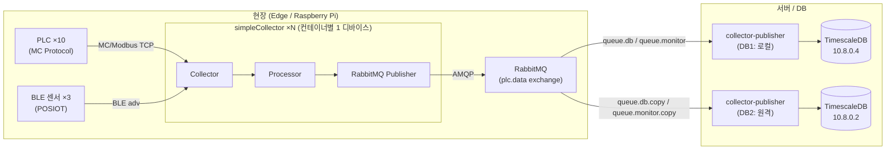
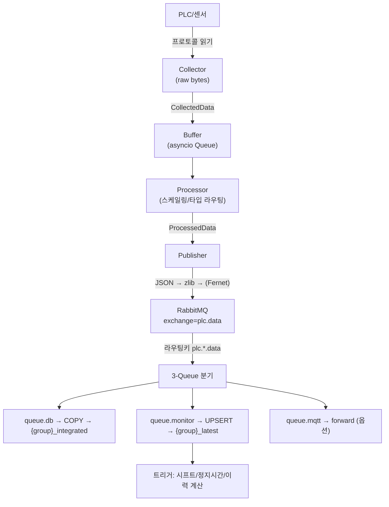
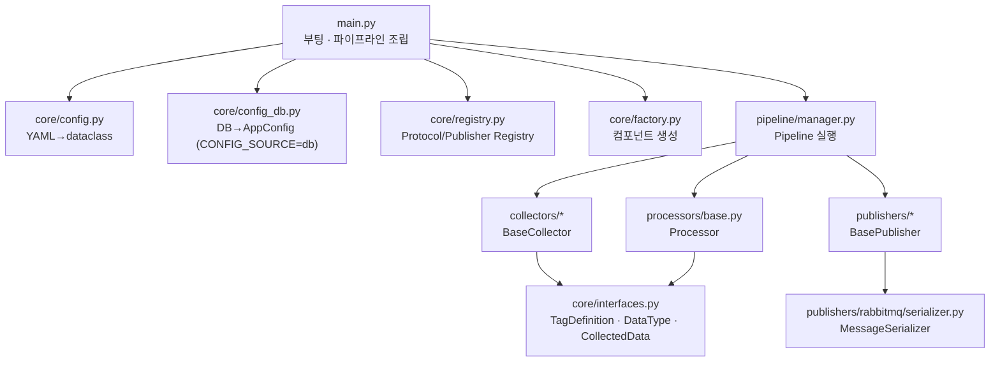
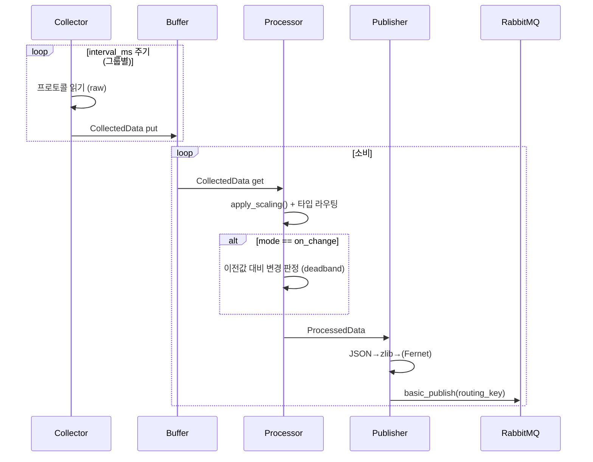
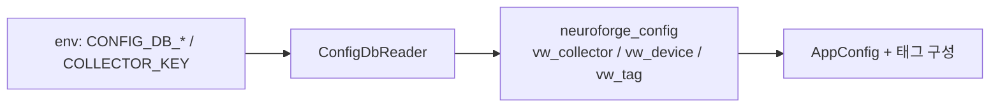
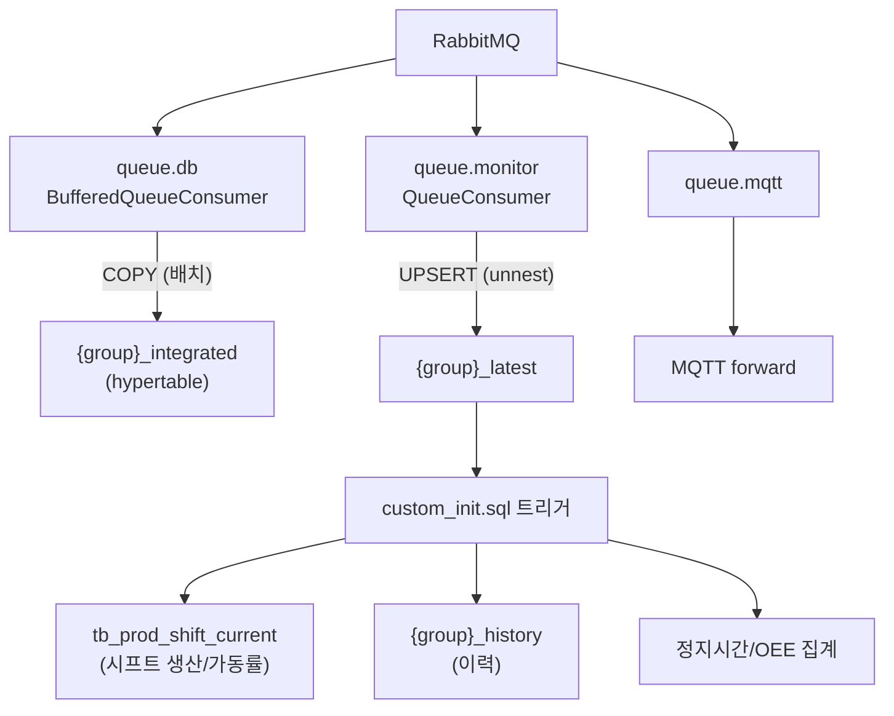
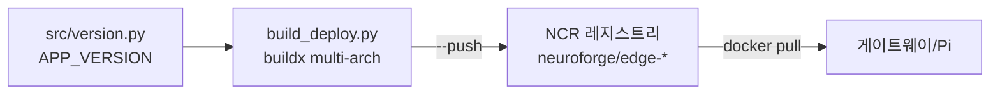

# NeuroForge 수집 플랫폼 — 아키텍처 & 모듈 문서

> PLC/센서 데이터를 수집해 RabbitMQ로 발행하고, TimescaleDB에 적재하는 asyncio 기반 산업 데이터 파이프라인.
> 본 문서는 **Notion import용 마크다운**입니다. (Notion: `Import → Markdown & CSV`, mermaid 코드블록은 자동 렌더링)

---

## 1. 한눈에 보기 (System Overview)



| 컴포넌트 | 역할 | 저장소 |
|---|---|---|
| **simpleCollector** | PLC/센서 → RabbitMQ 수집기 | `d:\4.source\simpleCollector` |
| **collector-publisher** | RabbitMQ → TimescaleDB/MQTT 적재 | `d:\4.source\collector-publisher` |
| **collectorhub** | 관리 플랫폼 (Agent + Web UI) | `d:\4.source\collectorhub` |

- 언어: Python 3.11+ (asyncio), 타입힌트 필수
- 커스텀 로그 레벨: `VERBOSE` (DEBUG와 INFO 사이)
- 배포: Docker (linux/amd64 + linux/arm64 multi-arch), NCR 레지스트리

---

## 2. 핵심 데이터 흐름 (End-to-End Flow)



**한 줄 요약**: `읽기 → 버퍼 → 스케일링 → 직렬화 → 발행 → (DB저장 / 최신값UPSERT / MQTT)`

---

## 3. simpleCollector — 모듈 구조



### 3.1 모듈 책임표

| 모듈 | 경로 | 역할 |
|---|---|---|
| **Entry** | `src/main.py` | 부팅, config 로드, 파이프라인 조립/시작, graceful shutdown |
| **Version** | `src/version.py` | 버전 SSOT (`APP_VERSION`, CHANGELOG, MODULE_VERSIONS) |
| **Config** | `src/core/config.py` | YAML+CSV → dataclass (`ConfigLoader._parse_config()`), env var 치환 |
| **Config DB** | `src/core/config_db.py` | `CONFIG_SOURCE=db`일 때 neuroforge_config 스키마에서 구성 |
| **Interfaces** | `src/core/interfaces.py` | `TagDefinition`, `DataType`, `CollectedData`, `ProcessedData`, `ConnectionState` |
| **Registry** | `src/core/registry.py` | `ProtocolRegistry` + `PublisherRegistry` (플러그인 등록) |
| **Factory** | `src/core/factory.py` | config 기반 Collector/Processor/Publisher 인스턴스 생성 |
| **Buffer** | `src/core/buffer.py` | 수집-처리 사이 asyncio 큐 (backpressure) |
| **Events** | `src/core/events.py` | 내부 이벤트(데이터 수집/손실/연결상태) 알림 |
| **Pipeline** | `src/pipeline/manager.py` | Collector+Processor+Publisher 1조 실행 단위 |
| **Processor** | `src/processors/base.py` | raw값 → 스케일링 → 타입별 컬럼 라우팅, on_change 판정 |
| **Publisher(base)** | `src/publishers/base.py` | `_do_connect/_do_disconnect/_do_publish/_do_health_check` 추상 |
| **RabbitMQ Pub** | `src/publishers/rabbitmq/publisher.py` | aio-pika 발행, 재연결 |
| **Serializer** | `src/publishers/rabbitmq/serializer.py` | JSON→zlib→(Fernet) 직렬화 (publisher와 포맷 공유) |
| **Logging** | `src/utils/logging.py`, `db_log_handler.py` | stdout + DB 로깅(`neuroforge_logs.collector_log`) |
| **Status API** | `src/services/status_api.py` | 헬스/상태 조회 엔드포인트 |

### 3.2 지원 프로토콜 (collectors/)

| 프로토콜 | 경로 | 대상 |
|---|---|---|
| **MC Protocol** | `collectors/mc_protocol/` | Mitsubishi iQ-R/Q/L/FX (운영 주력) |
| **Modbus** | `collectors/modbus/` | Pure-Python, TCP/RTU/RTU-over-TCP (pymodbus 미사용) |
| **S7** | `collectors/s7_protocol/` | Siemens S7 |
| **FEnet** | `collectors/fenet/` | LS ELECTRIC FEnet |
| **BLE** | `collectors/ble/` | BLE 광고 수집 (멀티디바이스, 프로파일 기반) |
| **LoRa** | `collectors/lora_rak5146/` | RAK5146 LoRa 게이트웨이 |

> 각 프로토콜은 `collector.py`(읽기) + `processor.py`(파싱) 한 쌍 + (BLE/LoRa는 `scanner.py`, `profiles/`) 구조로 동일 패턴을 따름. 새 프로토콜 추가는 `docs/PROTOCOL_DEVELOPMENT_GUIDE.md` 참고.

---

## 4. 파이프라인 작동 원리 (Pipeline)



- **Collector**와 **Publisher**는 `Buffer`(asyncio 큐)로 분리 → 읽기/발행이 서로 블로킹하지 않음 (backpressure)
- **재연결**: PLC 끊김 시 `_reconnect_loop` 영구 실행, 지수 백오프(30초 cap), 복구 시 INFO, LOSS 로그 throttle
- **부분 실패 허용**: 일부 태그 읽기 실패해도 나머지는 발행 (전체 중단 안 함)

---

## 5. 설정 시스템 (Config)

### 5.1 파일 모드 (기본, `CONFIG_SOURCE=file`)

```
collector_*.yaml   →  Collector/Protocol/Publisher 설정 (dataclass)
tags_*.csv         →  태그 정의 (TagDefinition 리스트)
```

**Tags CSV 포맷**
```csv
tag_id,tag_name,memory,address,data_type,collection_group,scale,offset,decimals,unit,string_length,word_length,format,description
1,D200,D,200,uint16,plc_data,1,0,,,,,,생산수량
6,D208,D,208,float32,plc_data,1,0,2,,,,,불량률
```

### 5.2 DB 모드 (`CONFIG_SOURCE=db`, 0.4.0+)


- YAML/CSV 대신 `neuroforge_config` 스키마 뷰에서 구성
- 미접속 시 영구 재시도, 기본은 file 모드라 기존 동작 불변

### 5.3 수집 그룹 (Collection Groups)

| 그룹 | 수집 방식 | 용도 |
|---|---|---|
| `plc_data` | polling (1~2s) | 실시간 데이터 |
| `alm` | on_change | 알람 (값 변경 시에만) |
| `log` | polling (5s) | 설비 로그 |
| `tl_data` | 100ms on_change | 타워램프 |

> `mode` 기본값은 **`polling`** (config.py). on_change를 쓰려면 그룹에 `mode: "on_change"` + `deadband` 명시 필요.
> BLE는 그룹 on_change 대신 **스캐너 중복필터**(`duplicate_filter_s`, `cache_ttl`)로 동작.

---

## 6. 태그 스케일링 (Tag Scaling)

`TagDefinition.apply_scaling()`:
```python
scaled = (raw_value * scale) + offset
if decimals > 0:
    if data_type in (FLOAT32, FLOAT64):
        scaled = round(scaled, decimals)            # float: 단순 반올림
    else:
        scaled = round(scaled / (10 ** decimals), decimals)  # 정수: 고정소수점 ÷10^decimals
```

| 예 | 입력 | 출력 |
|---|---|---|
| uint16, decimals=2 | raw 3061 | **30.61** (÷100) |
| float32, decimals=1 | raw 69.1 | 69.1 (그대로) |

> ⚠️ 정수 타입의 `decimals`는 **÷10^decimals 변환** (PLC/HMI 업계 표준), float는 round만.

---

## 7. 직렬화 (MessageSerializer)

```
JSON  →  zlib compress  →  Fernet encrypt (옵션)
```
- collector ↔ publisher **동일 포맷 공유** (불일치 시 복호화 실패)
- 기본값: `compression: "zlib"`, `encryption_enabled: false`

---

## 8. collector-publisher — 적재 측



| 모듈 | 역할 |
|---|---|
| `consumer.py` | `QueueConsumer`(단건), `BufferedQueueConsumer`(배치 flush) |
| `publishers/database.py` | `DatabasePublisher` — COPY(integrated) + UPSERT(latest) |
| `publishers/master_sync.py` | 재시작 시 `_master`/`_latest` TRUNCATE → CSV/DB로 재구성 |
| `publishers/schema_init.py` | 스키마/hypertable/압축·보관 정책 + extensions DDL 자동생성 |
| `publishers/config_db.py` | config DB 소스 로딩 |

### 8.1 그룹 저장 모드 (publisher YAML)

| mode | integrated | latest | 용도 |
|---|---|---|---|
| `all` | ✅ | ✅ | 시계열 + 최신값 |
| `latest` | ❌ | ✅ | 최신값만 (알람/로그) |
| `integrated` | ✅ | ❌ | 시계열만 |
| `none` | ❌ | ❌ | 미저장 |

### 8.2 Extensions (그룹별 부가기능)

```yaml
collection_groups:
  - name: "alm"
    mode: "all"
    extensions:
      history:                 # {group}_latest 변경 감지 → {group}_history INSERT
        trigger_on: "v_bool"
      snapshot:                # watch_tag rising edge → capture_tags 캡처
        triggers:
          - watch_tag: 1
            capture_tags: [1, 2, 3]
```
- DDL 자동생성: `_build_history_ddl()`, `_build_snapshot_ddl()`
- 테이블은 hypertable로 자동 변환, 압축/보관은 그룹 정책을 따름

### 8.3 Master Sync (재시작 동작)
1. `{group}_master` + `{group}_latest` **TRUNCATE** (stale/tag_id 충돌 방지)
2. collector YAML+CSV (또는 config DB) 스캔 → `plc_master` UPSERT + `{group}_master` INSERT
3. `_integrated`/`_history`/`_snapshot` 데이터는 **보존**

> tag_id는 CSV의 `tag_id` 컬럼에서 옴 → 안정적. **description은 표시용** (언어/이름 변경에 취약 → 트리거는 tag_id 매칭 권장).

---

## 9. 운영 메모 (Operational Notes)

### 9.1 alm_latest UPSERT 데드락
- **원인**: 한 publisher가 `monitor_prefetch`만큼 동시 처리 → 여러 pool 커넥션이 같은 `{group}_latest`를 **다른 락 순서**로 UPSERT → ShareLock 교착
- **무빌드 차단**: `monitor_prefetch: 1` (직렬화)
- **근본 fix (0.3.8)**: unnest 배열을 `(device_id, tag_id)` 정렬(락 순서 고정) + 데드락 시 지터 백오프 재시도

### 9.2 queue.db backlog / WAL
- `BufferedQueueConsumer` 버퍼가 `flush_size×3` 초과 시 경고
- 병목은 보통 **WAL fsync**(`synchronous_commit=on`) — DB/디스크 측. 버스트(재시작 드레인/백필)에 일시적

### 9.3 시프트 트래커 (custom_init.sql)
- `fn_production_shift_tracker()`가 `plc_data_latest` UPDATE마다 동기 실행
- 생산/NG 판별은 **`tb_prod_tag_map(plc_id → prod_tag_id, ng_tag_id)` 의 tag_id** 기준 (description 무관)
- `shift_production = 현재카운터 - run_start` (reset-aware 절대값) → 트리거 복구 시 자동 재계산

### 9.4 관측성 (알려진 약점)
- 파생값(시프트/이력/BLE)이 **조용히 멈춰도 능동 알림 없음** → stale 감지 모니터링 권장
- BLE는 Bleak/BlueZ 신뢰성에 의존 → 디바이스별 수신 끊김은 `no_device_data` 로그로만

---

## 10. 버전 & 빌드/배포



- **SSOT**: `src/version.py`의 `APP_VERSION` (metadata.json, CLAUDE.md 표 동기화)
- 코드 수정 시: 버전 범프 → CHANGELOG → 커밋 → 빌드 → NCR push
- semver 태그 immutable, `:latest`는 mutable
- 이미지: `neuroforge/edge-collector-mc`, `edge-collector-ble`, `edge-publisher`

---

## 11. 용어 (Glossary)

| 용어 | 의미 |
|---|---|
| **CollectedData** | Collector가 만든 raw 수집 결과 (프로토콜 무관) |
| **ProcessedData** | Processor가 스케일링/타입 라우팅한 결과 (DB 컬럼 단위) |
| **collection_group** | 태그를 주기/방식별로 묶은 단위 (plc_data, alm, log…) |
| **{group}_integrated** | 그룹별 시계열 hypertable (COPY 적재) |
| **{group}_latest** | 그룹별 최신값 (UPSERT) |
| **on_change** | 값 변경 시에만 발행 (deadband 적용) |
| **master_sync** | config → `*_master` 투영 (재시작 시 TRUNCATE+재구성) |

---

*문서 생성: Claude Code · 기준 버전 simpleCollector 0.4.5 / collector-publisher 0.3.8*
