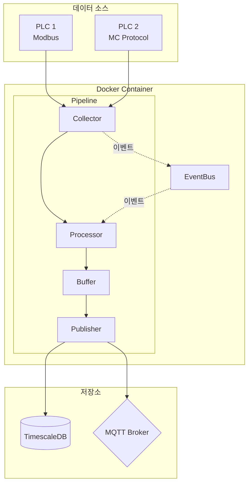
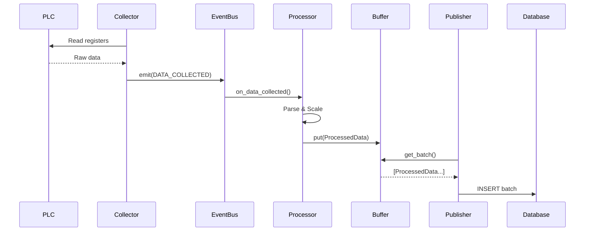
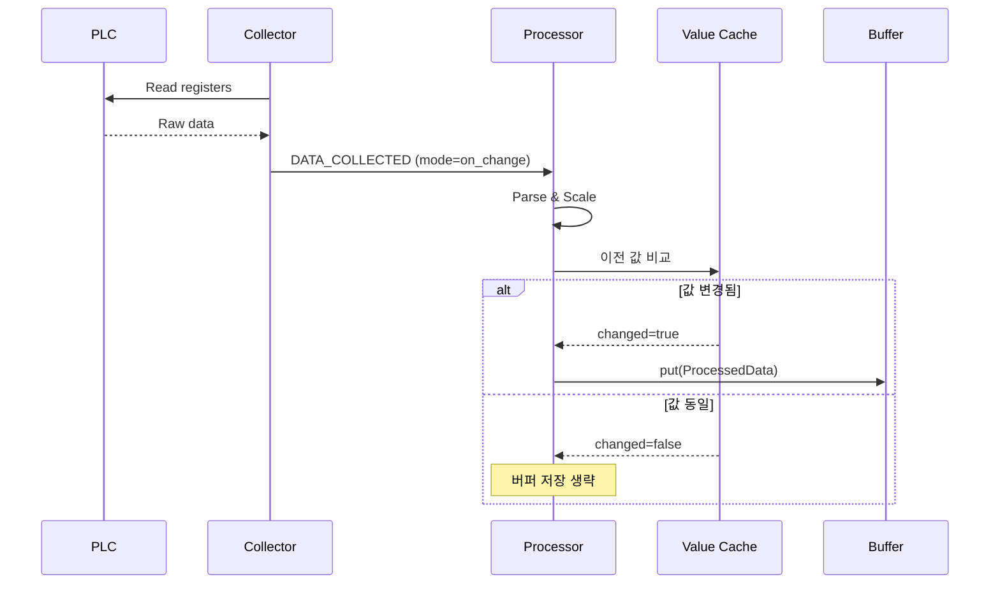
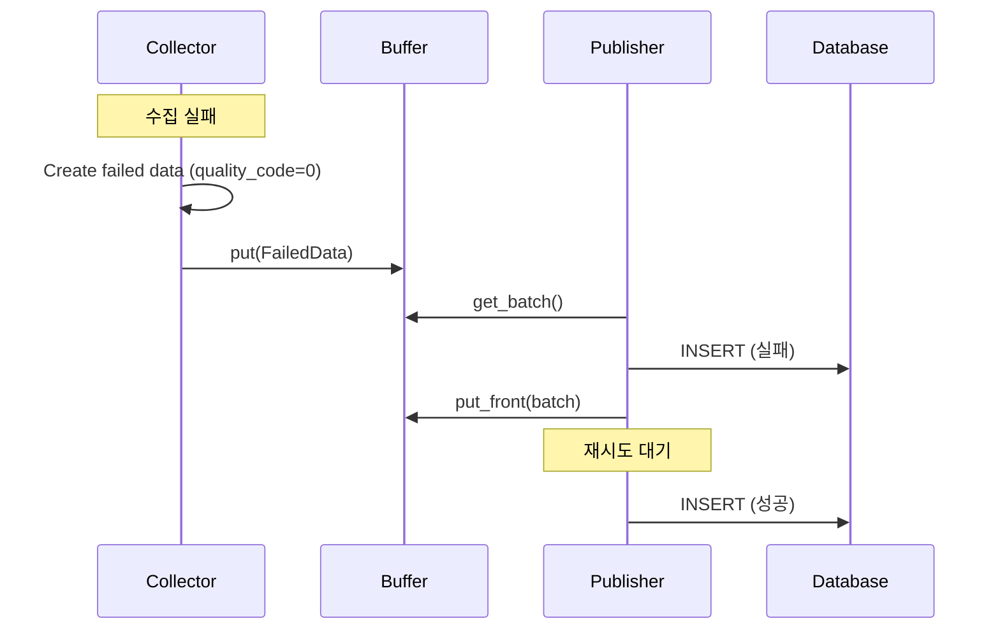

# 아키텍처 개요

Simple Collector의 시스템 아키텍처를 설명합니다.

---

## 설계 원칙

<div class="grid cards" markdown>

-   :material-puzzle:{ .lg .middle } **모듈화**

    ---

    프로토콜과 Publisher를 플러그인처럼 추가/제거 가능

-   :material-lightning-bolt:{ .lg .middle } **이벤트 기반**

    ---

    컴포넌트 간 느슨한 결합으로 유연성 확보

-   :material-sync:{ .lg .middle } **비동기**

    ---

    asyncio 기반 고성능 I/O 처리

-   :material-shield:{ .lg .middle } **신뢰성**

    ---

    자동 재연결, 버퍼링, 데이터 손실 추적

</div>

---

## 전체 구조



---

## 핵심 컴포넌트

### 1. Collector (수집기)

**역할:** 프로토콜별 데이터 수집

```
┌─────────────────────────────────────────┐
│               Collector                  │
│                                         │
│  ┌─────────────────────────────────┐   │
│  │     Collection Groups            │   │
│  │  ┌─────────┐  ┌─────────┐       │   │
│  │  │  1sec   │  │  1min   │  ...  │   │
│  │  │  Task   │  │  Task   │       │   │
│  │  └─────────┘  └─────────┘       │   │
│  └─────────────────────────────────┘   │
│                                         │
│  ┌─────────────────────────────────┐   │
│  │     Protocol Implementation      │   │
│  │  (Modbus / MC Protocol)         │   │
│  └─────────────────────────────────┘   │
└─────────────────────────────────────────┘
```

**주요 기능:**

- 그룹별 독립 수집 태스크
- 연속 주소 병합 읽기
- 자동 재연결
- 수집 실패 시 `quality_code=0` 생성
- 손실 추적 (연속/누적)

### 2. Processor (처리기)

**역할:** Raw 데이터 파싱, 스케일링, 변경 감지

```
┌────────────────────────────────────────┐
│              Processor                  │
│                                        │
│  EVENT: DATA_COLLECTED                 │
│          │                             │
│          ▼                             │
│  ┌────────────────────────────────┐   │
│  │     Parse Raw Data              │   │
│  │  (Protocol-specific decoding)   │   │
│  └────────────────────────────────┘   │
│          │                             │
│          ▼                             │
│  ┌────────────────────────────────┐   │
│  │     Apply Scaling               │   │
│  │  value = (raw * scale) + offset │   │
│  └────────────────────────────────┘   │
│          │                             │
│          ▼                             │
│  ┌────────────────────────────────┐   │
│  │     on_change Filter            │   │
│  │  (값 변경 시에만 통과)           │   │
│  └────────────────────────────────┘   │
│          │                             │
│          ▼                             │
│  ┌────────────────────────────────┐   │
│  │     Buffer.put(ProcessedData)   │   │
│  └────────────────────────────────┘   │
└────────────────────────────────────────┘
```

**주요 기능:**

- 프로토콜별 Raw 데이터 파싱
- 스케일링 적용 `(raw * scale) + offset`
- **on_change 모드**: 값 변경 시에만 전달 (알람/이벤트용)
- deadband 지원 (절대값/백분율)

**최적화:**

- 출력 타입 룩업 테이블
- 태그별 값 캐싱 (on_change 비교용)
- 지역 변수 최적화

### 3. Buffer (버퍼)

**역할:** 스레드 안전한 데이터 임시 저장

```
┌─────────────────────────────────────────┐
│                Buffer                    │
│                                         │
│  ┌─────────────────────────────────┐   │
│  │          FIFO Queue              │   │
│  │  [Data1][Data2][Data3]...[DataN] │   │
│  └─────────────────────────────────┘   │
│                                         │
│  Features:                              │
│  • Thread-safe (asyncio.Lock)          │
│  • Overflow handling                   │
│  • Batch extraction                    │
│  • Failed data return (put_front)      │
└─────────────────────────────────────────┘
```

### 4. Publisher (발행기)

**역할:** 외부 시스템으로 데이터 전송

```
┌────────────────────────────────────────┐
│              Publisher                  │
│                                        │
│  while running:                        │
│    batch = buffer.get_batch()          │
│    success = publish(batch)            │
│    if not success:                     │
│      buffer.put_front(batch)           │
│      retry()                           │
│                                        │
│  ┌────────────────────────────────┐   │
│  │    Target Implementation        │   │
│  │  • DatabasePublisher            │   │
│  │  • MqttPublisher                │   │
│  └────────────────────────────────┘   │
└────────────────────────────────────────┘
```

---

## 데이터 흐름

### 정상 흐름



### on_change 모드 흐름



### 실패 처리 흐름



---

## 이벤트 시스템

### EventBus 구조

```python
class EventBus:
    handlers: Dict[EventType, List[Handler]]

    def subscribe(event_type, handler):
        """이벤트 핸들러 등록"""

    def emit(event_type, data):
        """이벤트 발행"""
```

### 이벤트 타입

| 이벤트 | 발생 시점 | 데이터 |
|--------|-----------|--------|
| `DATA_COLLECTED` | 수집 완료 | CollectedData |
| `DATA_PROCESSED` | 처리 완료 | count, plc_id |
| `BUFFER_UPDATED` | 버퍼 추가 | current_size |
| `BUFFER_THRESHOLD` | 임계값 도달 | current_size |
| `DATA_PUBLISHED` | 발행 완료 | count |
| `PUBLISH_FAILED` | 발행 실패 | error |

---

## 모듈 구조

### 디렉토리 구조

```
src/
├── __init__.py           # 버전, 저작권
├── main.py               # 엔트리포인트
│
├── core/                 # 핵심 모듈
│   ├── interfaces.py     # 데이터 클래스
│   ├── config.py         # 설정 파싱
│   ├── buffer.py         # 버퍼
│   └── events.py         # 이벤트 버스
│
├── collectors/           # 수집기
│   ├── base.py           # BaseCollector
│   ├── modbus/           # Modbus
│   │   ├── collector.py
│   │   └── processor.py
│   └── mcprotocol/       # MC Protocol
│       ├── collector.py
│       └── processor.py
│
├── processors/           # 처리기
│   └── base.py           # BaseProcessor
│
├── publishers/           # 발행기
│   ├── base.py           # BasePublisher
│   ├── database.py       # TimescaleDB
│   └── mqtt.py           # MQTT
│
├── services/             # 서비스
│   └── master_sync.py    # 마스터 동기화
│
└── utils/                # 유틸리티
    └── logging.py        # 로깅
```

### 상속 구조

```
BaseCollector
├── ModbusCollector
└── MCProtocolCollector

BaseProcessor
├── ModbusProcessor
└── MCProtocolProcessor

BasePublisher
├── DatabasePublisher
└── MqttPublisher
```

---

## 성능 고려사항

### 권장 사양

| 항목 | 최소 | 권장 |
|------|------|------|
| CPU | 1 Core | 2+ Cores |
| RAM | 256 MB | 512 MB |
| Network | 100 Mbps | 1 Gbps |

### 처리량

| 구성 | 초당 태그 |
|------|----------|
| 단일 PLC, 100 태그 | ~1,000 |
| 단일 PLC, 1,000 태그 | ~10,000 |
| 최적화 모드 | ~50,000+ |

### 메모리 사용량

```
ProcessedData 1개 ≈ 100 bytes
버퍼 10,000개 ≈ 1 MB

권장 버퍼 = 초당 수집량 × 60초 × 2
```

---

<div align="center">

**NEUROSENSE Inc.** | *Intelligent Industrial Solutions*

</div>
