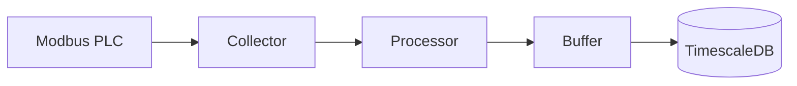

# 빠른 시작 가이드

5분 만에 첫 번째 데이터 수집을 시작하세요.

---

## 개요

이 가이드에서는 Modbus PLC에서 데이터를 수집하여 TimescaleDB에 저장하는 과정을 다룹니다.



---

## 1단계: 설정 파일 준비

### collector.yaml

```yaml title="config/collector.yaml"
# =============================================================================
# Simple Collector 설정
# =============================================================================

collector:
  plc_id: 1
  name: "Production_Line_1"

  protocol:
    type: modbus           # modbus 또는 mcprotocol
    host: "192.168.1.100"  # PLC IP 주소
    port: 502              # Modbus TCP 포트
    unit_id: 1             # Modbus Unit ID

  collection:
    - group: fast
      interval_ms: 1000    # 1초 주기
      tags_file: "config/tags_fast.csv"
    - group: slow
      interval_ms: 60000   # 1분 주기
      tags_file: "config/tags_slow.csv"

publisher:
  database:
    enabled: true
    host: "localhost"
    port: 5432
    database: "collector"
    user: "collector"
    password: "${DB_PASSWORD}"
    schema: "test"

  mqtt:
    enabled: false

buffer:
  max_size: 10000
  batch_size: 100

logging:
  level: "INFO"
  collection_level: "DEBUG"
  publish_level: "INFO"
  file_path: "logs/collector.log"
```

---

## 2단계: 태그 정의

### tags_fast.csv (1초 주기)

```csv title="config/tags_fast.csv"
tag_id,tag_name,memory,address,data_type,collection_group,scale,offset,decimals,word_length,format,unit,description
1,Temperature,D,100,float32,fast,1.0,0.0,2,,,°C,온도 센서
2,Pressure,D,102,float32,fast,1.0,0.0,2,,,bar,압력 센서
3,Speed,D,104,uint32,fast,0.1,0.0,1,,,rpm,모터 속도
4,Status,M,0,bool,fast,1.0,0.0,,,,,운전 상태
```

### tags_slow.csv (1분 주기)

```csv title="config/tags_slow.csv"
tag_id,tag_name,memory,address,data_type,collection_group,scale,offset,decimals,word_length,format,unit,description
101,Total_Count,D,200,uint32,slow,1.0,0.0,,,,,총 생산량
102,Error_Count,D,202,uint32,slow,1.0,0.0,,,,,에러 횟수
103,Model_Name,D,300,string,slow,1.0,0.0,,10,,,현재 모델명
```

---

## 3단계: 데이터베이스 설정

### TimescaleDB 초기화

```bash
# TimescaleDB 실행 (Docker)
docker run -d \
  --name timescaledb \
  -p 5432:5432 \
  -e POSTGRES_PASSWORD=password \
  timescale/timescaledb:latest-pg15

# 데이터베이스 및 테이블 생성
docker exec -i timescaledb psql -U postgres < scripts/init-db.sql
```

### 테이블 구조

```sql
-- 데이터 테이블
CREATE TABLE test.plc_data (
    time        TIMESTAMPTZ NOT NULL,
    plc_id      SMALLINT NOT NULL,
    tag_id      INTEGER NOT NULL,
    v_int       INTEGER,
    v_bigint    BIGINT,
    v_float     DOUBLE PRECISION,
    v_text      TEXT,
    v_byte      SMALLINT,
    v_bool      BOOLEAN,
    quality_code SMALLINT DEFAULT 1
);

-- 하이퍼테이블 변환
SELECT create_hypertable('test.plc_data', 'time');
```

---

## 4단계: 실행

### Docker로 실행

```bash
# 환경 변수 설정
export DB_PASSWORD=password

# 실행
docker compose up -d

# 로그 확인
docker compose logs -f collector
```

### 직접 실행

```bash
# 환경 변수 설정
export DB_PASSWORD=password

# 실행
python -m src.main --config config/collector.yaml
```

---

## 5단계: 데이터 확인

### 로그 확인

```bash
# 정상 로그 예시
2026-02-05 10:00:00 | INFO | [collection] Collected 4 tags from group 'fast'
2026-02-05 10:00:00 | INFO | [publish] Published 4 records to database
2026-02-05 10:00:01 | INFO | [collection] Collected 4 tags from group 'fast'
```

### 데이터베이스 확인

```sql
-- 최근 데이터 조회
SELECT time, tag_id, v_float, quality_code
FROM test.plc_data
ORDER BY time DESC
LIMIT 10;

-- 태그별 최신값
SELECT DISTINCT ON (tag_id)
    tag_id, v_float, time
FROM test.plc_data
ORDER BY tag_id, time DESC;
```

---

## 예상 출력

### 콘솔 출력

```
2026-02-05 10:00:00.123 | INFO | collector.system | Logging initialized
2026-02-05 10:00:00.456 | INFO | collector.system | Connecting to PLC...
2026-02-05 10:00:01.000 | INFO | collector.collection | [fast] Collected 4 tags
2026-02-05 10:00:01.050 | DEBUG | collector.collection | Tag 1 (Temperature): 25.50
2026-02-05 10:00:01.051 | DEBUG | collector.collection | Tag 2 (Pressure): 1.23
2026-02-05 10:00:01.100 | INFO | collector.publish | Published 4 records
```

### 데이터베이스

```
      time          | tag_id | v_float | quality_code
--------------------+--------+---------+--------------
2026-02-05 10:00:01 |      1 |   25.50 |            1
2026-02-05 10:00:01 |      2 |    1.23 |            1
2026-02-05 10:00:01 |      3 |  1500.0 |            1
2026-02-05 10:00:01 |      4 |    NULL |            1  (bool -> v_bool)
```

---

## 문제 해결

### PLC 연결 실패

```
ERROR | Connection to 192.168.1.100:502 failed
```

**해결책:**

1. PLC IP 주소 확인
2. 방화벽 설정 확인
3. Modbus TCP 활성화 확인

### 데이터베이스 연결 실패

```
ERROR | Database connection failed: connection refused
```

**해결책:**

1. TimescaleDB 실행 상태 확인
2. 포트 및 비밀번호 확인
3. 네트워크 연결 확인

---

## 다음 단계

<div class="grid cards" markdown>

-   :material-cog:{ .lg .middle } **설정 상세**

    ---

    YAML 및 CSV 설정 심화

    [:octicons-arrow-right-24: 설정 가이드](../configuration/index.md)

-   :material-connection:{ .lg .middle } **프로토콜**

    ---

    Modbus, MC Protocol 상세

    [:octicons-arrow-right-24: 프로토콜](../protocols/index.md)

-   :material-database:{ .lg .middle } **Publisher**

    ---

    Database, MQTT 설정

    [:octicons-arrow-right-24: Publisher](../publishers/index.md)

</div>

---

<div align="center">

**NEUROSENSE Inc.** | *Intelligent Industrial Solutions*

</div>
