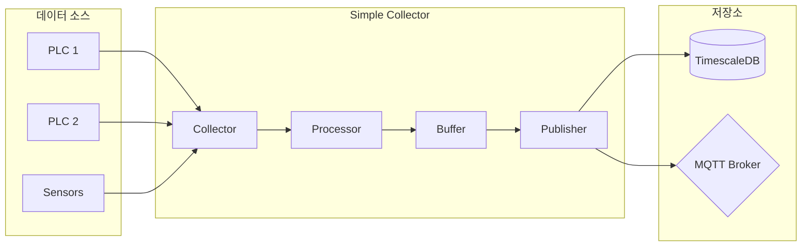

<div class="hero-section">
<h1>Simple Collector</h1>
<p class="hero-tagline">Industrial Data Collection Framework</p>
<p>Version 0.2.0-beta | NEUROSENSE Inc.</p>
</div>

---

## 개요

Simple Collector는 산업용 데이터 수집을 위한 고성능 프레임워크입니다.
PLC, 센서 등 다양한 산업 장비에서 데이터를 수집하여 TimescaleDB, MQTT 등으로 전송합니다.

### 주요 특징

<div class="grid cards" markdown>

-   :material-clock-fast:{ .lg .middle } 고성능 수집

    ---

    비동기 기반 설계로 대용량 데이터를 빠르게 수집

    - 초당 10,000+ 태그 처리
    - 메모리 최적화된 버퍼링
    - 연속 주소 병합 읽기

-   :material-connection:{ .lg .middle } 다양한 프로토콜

    ---

    산업 표준 프로토콜 지원

    - Modbus TCP
    - MC Protocol (Mitsubishi)
    - FENET (LS Electric XGT)
    - S7 Protocol (Siemens)
    - OPC UA (보안 지원)

-   :material-database:{ .lg .middle } 유연한 저장소

    ---

    다양한 목적지로 데이터 전송

    - TimescaleDB (시계열)
    - MQTT (실시간)
    - 커스텀 Publisher

-   :material-shield-check:{ .lg .middle } 신뢰성

    ---

    데이터 무결성 보장

    - 자동 재연결
    - 손실 추적 및 로깅
    - quality_code 기반 품질 관리

</div>

---

## 아키텍처



---

## 빠른 시작

### 1. 설치

```bash
# Docker 사용 (권장)
docker-compose up -d

# 또는 직접 실행
pip install -r requirements.txt
python -m src.main
```

### 2. 설정

```yaml title="config/collector.yaml"
collector:
  plc_id: 1
  name: "PLC1_Collector"
  protocol:
    type: modbus
    host: "192.168.1.100"
    port: 502

publisher:
  database:
    enabled: true
    host: "localhost"
    port: 5432
```

### 3. 태그 정의

```csv title="config/tags.csv"
tag_id,tag_name,memory,address,data_type,collection_group,scale,offset
1,Temperature,HR,100,float32,fast,1.0,0.0
2,Pressure,HR,102,uint32,fast,0.01,0.0
```

[전체 설치 가이드 보기](getting-started/installation.md){ .md-button .md-button--primary }

---

## 버전 정보

| 컴포넌트 | 버전 | 상태 |
|---------|------|------|
| Simple Collector | 0.2.0-beta | 개발중 |
| Core Module | 0.2.0 | 안정 |
| Modbus Collector | 0.2.0 | 안정 |
| MC Protocol Collector | 0.2.0 | 안정 |
| FENET Collector | 0.2.0 | 안정 |
| S7 Protocol Collector | 0.2.0 | 안정 |
| OPC UA Collector | 0.2.0 | 안정 |
| Database Publisher | 0.2.0 | 안정 |
| MQTT Publisher | 0.1.0 | 베타 |

---

<div align="center">

NEUROSENSE Inc.

Intelligent Industrial Solutions

</div>
