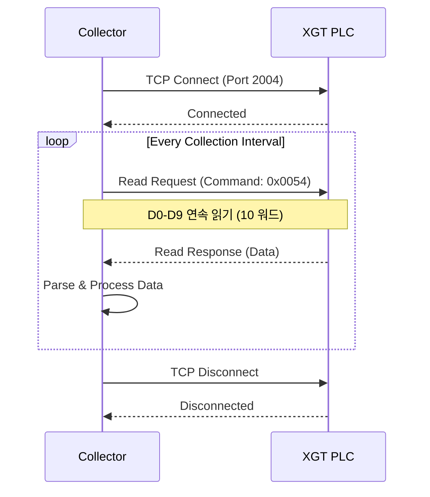

# FENET Protocol (LS Electric XGT)

LS Electric의 XGT PLC 시리즈와 통신하기 위한 FENET 프로토콜 가이드입니다.

---

## 개요

FENET은 LS Electric(구 LS산전)의 XGT PLC 시리즈를 위한 전용 이더넷 통신 프로토콜입니다.
XGK, XGB, XGI, XGR 시리즈에서 사용됩니다.

### 지원 PLC 시리즈

| 시리즈 | 설명 | 지원 CPU |
|--------|------|----------|
| **XGK** | 중대형 PLC | XGK-CPUA, XGK-CPUE 등 |
| **XGB** | 소형 PLC | XGB-XBCH, XGB-XBCL 등 |
| **XGI** | 중형 PLC | XGI-CPUU, XGI-CPUE 등 |
| **XGR** | 고속 모션 | XGR-CPUH |

### 프로토콜 특징

- **포트**: TCP 2004
- **프레임 형식**: LSIS-XGT 독자 프로토콜
- **최대 워드**: 요청당 60개 (1프레임)
- **인보크 ID**: 요청/응답 매칭용 고유 번호
- **통신 모드**: 폴링 (주기적 읽기)

---

## 연결 설정

### YAML 설정

```yaml title="config/collector.yaml"
collector:
  plc_id: 1
  name: "XGT_PLC"

  protocol:
    type: fenet
    host: "192.168.1.100"
    port: 2004                    # FENET 기본 포트
    timeout_ms: 3000
    reconnect_interval_ms: 5000

    extra:
      slot_number: 0              # CPU 슬롯 번호 (기본: 0)
      company_id: "LSIS-XGT"      # 프로토콜 식별자
```

### PLC 설정 (XG5000)

1. **PLC 파라미터 설정**
   - 프로젝트 → 파라미터 → 기본 파라미터 → 통신
   - "내장 Ethernet 사용" 체크

2. **IP 주소 설정**
   - IP 주소: 192.168.1.100 (예시)
   - 서브넷 마스크: 255.255.255.0
   - 게이트웨이: 192.168.1.1

3. **포트 설정**
   - TCP 포트: 2004 (기본값)
   - 연결 모드: 서버 모드

---

## 프레임 구조

### 요청 프레임 (Request Frame)

```
┌──────────────────────────────────────────────────────────────────┐
│                        FENET 요청 프레임                         │
├────────────┬────────┬─────────────────────────────────────────────┤
│   Offset   │  Size  │               Description                  │
├────────────┼────────┼─────────────────────────────────────────────┤
│    0       │   8    │ Company ID ("LSIS-XGT")                    │
│    8       │   2    │ Reserved (0x0000)                          │
│   10       │   2    │ PLC Info (0x0000)                          │
│   12       │   1    │ CPU Position (Slot Number)                 │
│   13       │   1    │ Reserved                                   │
│   14       │   2    │ Invoke ID (Request/Response 매칭)          │
│   16       │   2    │ Data Length                                │
│   18       │   1    │ Position (0x00)                            │
│   19       │   1    │ Reserved                                   │
│   20       │   2    │ Command (0x0054: Read, 0x0058: Write)      │
│   22       │   2    │ Data Type (0x0000: 연속읽기)               │
│   24       │   2    │ Reserved                                   │
│   26       │   2    │ Block Count                                │
│   28       │   N    │ Block Data (디바이스 정보)                  │
└────────────┴────────┴─────────────────────────────────────────────┘
```

### 응답 프레임 (Response Frame)

```
┌──────────────────────────────────────────────────────────────────┐
│                        FENET 응답 프레임                         │
├────────────┬────────┬─────────────────────────────────────────────┤
│   Offset   │  Size  │               Description                  │
├────────────┼────────┼─────────────────────────────────────────────┤
│    0       │   8    │ Company ID ("LSIS-XGT")                    │
│    8       │   2    │ Reserved                                   │
│   10       │   2    │ PLC Info                                   │
│   12       │   1    │ CPU Position                               │
│   13       │   1    │ Reserved                                   │
│   14       │   2    │ Invoke ID                                  │
│   16       │   2    │ Data Length                                │
│   18       │   1    │ Position                                   │
│   19       │   1    │ Reserved                                   │
│   20       │   2    │ Command Response                           │
│   22       │   2    │ Data Type                                  │
│   24       │   2    │ Reserved                                   │
│   26       │   2    │ Error Code (0: 성공)                       │
│   28       │   2    │ Block Count                                │
│   30       │   N    │ Data (읽은 데이터)                         │
└────────────┴────────┴─────────────────────────────────────────────┘
```

---

## 디바이스 코드

### 지원 디바이스

| 디바이스 | 코드 | 설명 | 접근 단위 | 비고 |
|----------|------|------|-----------|------|
| **P** | 0x00 | 입력 릴레이 | Bit/Word | 입력 접점 |
| **M** | 0x01 | 보조 릴레이 | Bit/Word | 내부 릴레이 |
| **K** | 0x02 | Keep 릴레이 | Bit/Word | 정전 유지 |
| **F** | 0x03 | 특수 릴레이 | Bit/Word | 시스템 플래그 |
| **T** | 0x04 | 타이머 | Word | 현재값 |
| **C** | 0x05 | 카운터 | Word | 현재값 |
| **D** | 0x06 | 데이터 레지스터 | Word | 범용 데이터 |
| **L** | 0x07 | 링크 릴레이 | Bit/Word | 통신용 |
| **U** | 0x08 | 버퍼 메모리 | Word | 특수 모듈 |
| **Z** | 0x09 | 인덱스 레지스터 | Word | 간접 주소 |
| **R** | 0x0A | 파일 레지스터 | Word | 확장 메모리 |

### 주소 형식

```
┌─────────────────────────────────────────────────────────────┐
│                      주소 형식 예시                         │
├─────────────────────────────────────────────────────────────┤
│  D00000     → 데이터 레지스터 D0 (워드)                     │
│  D00100     → 데이터 레지스터 D100                          │
│  M00000     → 보조 릴레이 M0 (비트)                         │
│  T00010     → 타이머 T10 현재값                             │
│  C00005     → 카운터 C5 현재값                              │
│  R00000     → 파일 레지스터 R0                              │
└─────────────────────────────────────────────────────────────┘
```

---

## 태그 설정

### CSV 형식

```csv title="config/tags_fenet.csv"
tag_id,tag_name,memory,address,data_type,collection_group,scale,offset,unit,description
1,Temperature,D,0,float32,fast,1.0,0.0,°C,온도 측정값
2,Pressure,D,2,float32,fast,1.0,0.0,bar,압력 측정값
3,Motor_Speed,D,4,uint16,fast,0.1,0.0,rpm,모터 속도
4,Run_Flag,M,0,bool,fast,1.0,0.0,,운전 상태
5,Error_Flag,M,10,bool,fast,1.0,0.0,,에러 상태
6,Counter_Value,C,0,uint32,slow,1.0,0.0,,생산 카운터
```

### 데이터 타입 매핑

| CSV 타입 | 워드 수 | 설명 |
|----------|---------|------|
| `bool` | 1 | 비트 (0/1) |
| `int16` | 1 | 부호 있는 16비트 |
| `uint16` | 1 | 부호 없는 16비트 |
| `int32` | 2 | 부호 있는 32비트 |
| `uint32` | 2 | 부호 없는 32비트 |
| `float32` | 2 | IEEE 754 단정밀도 |
| `string` | N | ASCII 문자열 (word_length 필요) |

---

## 통신 흐름

### 연결 및 데이터 읽기



### 연속 주소 병합

Simple Collector는 연속 주소를 자동 병합합니다:

```
# 개별 요청 (비효율적)
D0 → D1 → D2 → D3 → D4  (5회 요청)

# 병합 요청 (최적화)
D0-D4 연속 읽기 (1회 요청)
```

---

## 에러 코드

### FENET 에러 코드

| 코드 | 의미 | 원인 | 해결 방법 |
|------|------|------|-----------|
| 0x0000 | 성공 | - | - |
| 0x0001 | 디바이스 오류 | 잘못된 디바이스 코드 | 디바이스 타입 확인 |
| 0x0002 | 주소 오류 | 존재하지 않는 주소 | 주소 범위 확인 |
| 0x0003 | 데이터 오류 | 잘못된 데이터 형식 | 데이터 타입 확인 |
| 0x0004 | 통신 오류 | 통신 프로토콜 오류 | 프레임 구조 확인 |
| 0x0005 | CPU 오류 | CPU 상태 이상 | PLC 상태 확인 |

---

## 트러블슈팅

### 연결 실패

!!! failure "Connection refused"
    ```
    ERROR | Connection to 192.168.1.100:2004 failed
    ```

    **확인 사항:**

    1. PLC 전원 및 네트워크 연결 확인
    2. IP 주소 및 포트 번호 확인 (기본: 2004)
    3. XG5000에서 내장 Ethernet 활성화 확인
    4. 방화벽 설정 확인

### 응답 타임아웃

!!! warning "Read timeout"
    ```
    WARNING | Read timeout for D0: 3.0s exceeded
    ```

    **해결 방법:**

    1. 타임아웃 값 증가 (`timeout_ms: 5000`)
    2. 네트워크 상태 확인
    3. PLC CPU 부하 확인
    4. 읽기 워드 수 감소

### 디바이스 오류

!!! error "Device error"
    ```
    ERROR | Invalid device code: 0x0001
    ```

    **확인 사항:**

    1. 디바이스 타입 올바른지 확인 (D, M, T, C 등)
    2. 주소 범위가 PLC에서 지원하는지 확인
    3. XG5000에서 디바이스 할당 확인

---

## 성능 최적화

### 권장 설정

| 항목 | 권장값 | 설명 |
|------|--------|------|
| 수집 주기 | 100ms ~ 1s | PLC CPU 부하 고려 |
| 요청당 워드 | 최대 60개 | 프레임 크기 제한 |
| 타임아웃 | 3000ms | 네트워크 상태에 따라 조정 |
| 재연결 간격 | 5000ms | 연결 실패 시 재시도 간격 |

### 최적화 팁

1. **연속 주소 배치**: 태그 주소를 연속으로 배치하여 병합 효율 증가
2. **그룹 분리**: 수집 주기가 다른 태그를 별도 그룹으로 분리
3. **비트 최소화**: 비트 디바이스보다 워드 디바이스 선호

---

## 코드 예제

### Python 직접 사용

```python
from src.collectors.fenet import FenetCollector
from src.core.config import CollectorConfig
from src.core.interfaces import TagDefinition, DataType

# 설정
config = CollectorConfig(
    plc_id=1,
    name="XGT_Collector",
    protocol=ProtocolConfig(
        type="fenet",
        host="192.168.1.100",
        port=2004,
        timeout_ms=3000,
    ),
    collection_groups=[
        CollectionGroup(name="fast", interval_ms=1000)
    ],
)

# 수집기 생성
collector = FenetCollector(
    plc_id=1,
    name="XGT",
    config=config,
)

# 태그 등록
tags = [
    TagDefinition(tag_id=1, tag_name="Temp", address="D0", data_type=DataType.FLOAT32),
    TagDefinition(tag_id=2, tag_name="Speed", address="D2", data_type=DataType.UINT16),
]
collector.register_tags("fast", tags)

# 시작
await collector.start()
```

---

## 참고 자료

- [LS Electric XGT FEnet 사용자 매뉴얼](https://www.lselectric.co.kr/)
- [XG5000 프로그램 사용 설명서](https://www.lselectric.co.kr/)
- LS Electric 기술지원: 1544-2080

---

<div align="center">

**NEUROSENSE Inc.** | *Intelligent Industrial Solutions*

</div>
