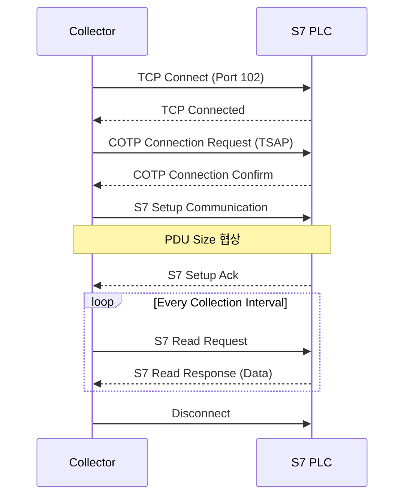

# S7 Protocol (Siemens)

Siemens S7 PLC 시리즈와 통신하기 위한 S7 프로토콜 가이드입니다.

---

## 개요

S7 Protocol은 Siemens의 S7 PLC 시리즈를 위한 산업 표준 통신 프로토콜입니다.
ISO-on-TCP (RFC 1006) 기반으로 구현되며, snap7 라이브러리를 사용합니다.

### 지원 PLC 시리즈

| 시리즈 | 설명 | 연결 타입 |
|--------|------|-----------|
| **S7-300** | 중형 PLC | MPI/Ethernet |
| **S7-400** | 대형 PLC | MPI/Profibus/Ethernet |
| **S7-1200** | 컴팩트 PLC | Ethernet |
| **S7-1500** | 최신 고성능 PLC | Ethernet |

### 프로토콜 특징

- **포트**: TCP 102
- **프레임 형식**: ISO-on-TCP (COTP/TPKT)
- **최대 바이트**: 요청당 200바이트 (PDU 크기에 따라 조정)
- **연결 방식**: TSAP 기반 연결
- **보안**: S7-1500 PUT/GET 허용 설정 필요

---

## 연결 설정

### YAML 설정

```yaml title="config/collector.yaml"
collector:
  plc_id: 1
  name: "Siemens_PLC"

  protocol:
    type: s7
    host: "192.168.1.100"
    port: 102                     # ISO-on-TCP 기본 포트
    timeout_ms: 3000
    reconnect_interval_ms: 5000

    extra:
      rack: 0                     # PLC 랙 번호
      slot: 1                     # CPU 슬롯 번호 (S7-300/400: 2, S7-1200/1500: 1)
      pdu_size: 480               # PDU 크기 (기본: 480)
```

### Rack/Slot 설정

| PLC 모델 | Rack | Slot | 비고 |
|----------|------|------|------|
| S7-300 | 0 | 2 | CPU가 슬롯 2에 위치 |
| S7-400 | 0 | 2~3 | CPU 슬롯 확인 필요 |
| S7-1200 | 0 | 1 | 고정값 |
| S7-1500 | 0 | 1 | 고정값 |

### TIA Portal 설정 (S7-1200/1500)

1. **PUT/GET 통신 허용**
   - 프로젝트 → PLC → 속성 → 보호 → 연결 메커니즘
   - "PUT/GET 통신의 원격 파트너에서 액세스 허용" 체크

2. **DB 최적화 해제** (Optimized block access)
   - 데이터 블록 → 속성 → 최적화된 블록 액세스 해제
   - 또는 "비최적화된 데이터 블록" 생성

3. **네트워크 설정**
   - 장치 및 네트워크 → Ethernet 인터페이스 → IP 주소 설정

---

## 메모리 영역

### 지원 영역

| 영역 | 코드 | 설명 | 주소 예시 |
|------|------|------|-----------|
| **I** | 0x81 | 입력 (Input) | I0.0, IB0, IW0, ID0 |
| **Q** | 0x82 | 출력 (Output) | Q0.0, QB0, QW0, QD0 |
| **M** | 0x83 | 메모리 (Merker) | M0.0, MB0, MW0, MD0 |
| **DB** | 0x84 | 데이터 블록 | DB1.DBX0.0, DB1.DBW0 |
| **T** | 0x1D | 타이머 | T0, T1 |
| **C** | 0x1C | 카운터 | C0, C1 |

### 주소 형식

```
┌─────────────────────────────────────────────────────────────┐
│                      주소 형식 예시                         │
├─────────────────────────────────────────────────────────────┤
│  비트 주소:                                                 │
│    M0.0        → 메모리 바이트 0, 비트 0                    │
│    I1.5        → 입력 바이트 1, 비트 5                      │
│    Q2.7        → 출력 바이트 2, 비트 7                      │
│    DB1.DBX0.0  → DB1, 바이트 0, 비트 0                      │
├─────────────────────────────────────────────────────────────┤
│  바이트/워드/더블워드 주소:                                  │
│    MB0         → 메모리 바이트 0                            │
│    MW0         → 메모리 워드 0 (바이트 0-1)                 │
│    MD0         → 메모리 더블워드 0 (바이트 0-3)             │
│    DB1.DBB0    → DB1, 바이트 0                              │
│    DB1.DBW0    → DB1, 워드 0 (바이트 0-1)                   │
│    DB1.DBD0    → DB1, 더블워드 0 (바이트 0-3)               │
└─────────────────────────────────────────────────────────────┘
```

---

## 태그 설정

### CSV 형식

```csv title="config/tags_s7.csv"
tag_id,tag_name,memory,address,data_type,collection_group,scale,offset,unit,description
1,Temperature,DB1,DBD0,float32,fast,1.0,0.0,°C,온도 측정값
2,Pressure,DB1,DBD4,float32,fast,1.0,0.0,bar,압력 측정값
3,Speed,DB1,DBW8,int16,fast,1.0,0.0,rpm,모터 속도
4,Status,DB1,DBB10,uint8,fast,1.0,0.0,,상태 바이트
5,Run_Flag,M,0.0,bool,fast,1.0,0.0,,운전 상태
6,Input1,I,0.0,bool,fast,1.0,0.0,,입력 1
7,Output1,Q,0.0,bool,fast,1.0,0.0,,출력 1
```

### 주소 형식 상세

| 형식 | 설명 | 예시 |
|------|------|------|
| `DB{n}.DBX{byte}.{bit}` | DB 비트 | DB1.DBX0.0 |
| `DB{n}.DBB{byte}` | DB 바이트 | DB1.DBB0 |
| `DB{n}.DBW{byte}` | DB 워드 | DB1.DBW0 |
| `DB{n}.DBD{byte}` | DB 더블워드 | DB1.DBD0 |
| `M{byte}.{bit}` | 메모리 비트 | M0.0 |
| `MW{byte}` | 메모리 워드 | MW0 |
| `MD{byte}` | 메모리 더블워드 | MD0 |
| `I{byte}.{bit}` | 입력 비트 | I0.0 |
| `IW{byte}` | 입력 워드 | IW0 |
| `Q{byte}.{bit}` | 출력 비트 | Q0.0 |

---

## 데이터 타입

### 지원 타입

| S7 타입 | CSV 타입 | 크기 | 설명 |
|---------|----------|------|------|
| BOOL | `bool` | 1 bit | 불리언 |
| BYTE | `uint8` | 1 byte | 부호 없는 8비트 |
| SINT | `int8` | 1 byte | 부호 있는 8비트 |
| WORD | `uint16` | 2 bytes | 부호 없는 16비트 |
| INT | `int16` | 2 bytes | 부호 있는 16비트 |
| DWORD | `uint32` | 4 bytes | 부호 없는 32비트 |
| DINT | `int32` | 4 bytes | 부호 있는 32비트 |
| REAL | `float32` | 4 bytes | 32비트 실수 |
| LREAL | `float64` | 8 bytes | 64비트 실수 |
| STRING | `string` | N bytes | 문자열 (S7 STRING 형식) |

### 바이트 오더

S7 프로토콜은 **Big Endian** (Motorola 방식)을 사용합니다:

```
REAL (32비트 실수): 3.14
메모리 배치: [40][48][F5][C3]  (상위 바이트가 낮은 주소)
```

---

## 통신 구조

### ISO-on-TCP 프로토콜 스택

```
┌─────────────────────────────────────┐
│          Application (S7)           │
├─────────────────────────────────────┤
│         S7 Communication            │
├─────────────────────────────────────┤
│       COTP (ISO 8073 Class 0)       │
├─────────────────────────────────────┤
│       TPKT (RFC 1006)               │
├─────────────────────────────────────┤
│             TCP                      │
├─────────────────────────────────────┤
│              IP                      │
└─────────────────────────────────────┘
```

### 연결 과정



### TSAP 주소

| 클라이언트 | PLC | 설명 |
|-----------|-----|------|
| 01 00 | 03 {Rack*32+Slot} | 표준 연결 |

예: Rack=0, Slot=1 → TSAP: 03 01

---

## 성능 최적화

### PDU 크기

| PLC 모델 | 기본 PDU | 최대 PDU |
|----------|---------|----------|
| S7-300 | 240 | 240 |
| S7-400 | 480 | 960 |
| S7-1200 | 240 | 240 |
| S7-1500 | 480 | 960 |

### 요청당 최대 바이트

```
최대 읽기 바이트 = PDU - 18 (헤더)

PDU 240  → 최대 222 바이트/요청
PDU 480  → 최대 462 바이트/요청
```

### 최적화 전략

1. **연속 영역 읽기**: 연속된 주소는 한 번에 읽기
2. **DB 블록 정리**: 관련 데이터를 같은 DB에 배치
3. **그룹 분리**: 수집 주기별 태그 그룹화

---

## 에러 처리

### S7 에러 코드

| 코드 | 의미 | 원인 |
|------|------|------|
| 0x0000 | 성공 | - |
| 0x0001 | Hardware fault | 하드웨어 오류 |
| 0x0003 | Accessing the object not allowed | 접근 권한 없음 |
| 0x0005 | Invalid address | 잘못된 주소 |
| 0x0006 | Data type not supported | 지원되지 않는 데이터 타입 |
| 0x000A | Object does not exist | 객체 존재하지 않음 |
| 0x8104 | No data available | 데이터 없음 |
| 0x8500 | Access denied | PUT/GET 비활성화 |

### 일반적인 문제

!!! failure "Connection refused"
    ```
    ERROR | Connection to 192.168.1.100:102 failed
    ```

    **확인 사항:**

    1. PLC 전원 및 네트워크 연결
    2. IP 주소 확인 (TIA Portal에서)
    3. 포트 102 방화벽 확인
    4. Rack/Slot 번호 확인

!!! warning "Access denied (0x8500)"
    ```
    ERROR | S7 Read error: Access denied
    ```

    **해결 방법:**

    1. TIA Portal에서 "PUT/GET 통신 허용" 활성화
    2. 프로젝트 다시 다운로드
    3. PLC 재시작

!!! error "Invalid address"
    ```
    ERROR | Invalid address: DB1.DBW1000
    ```

    **확인 사항:**

    1. DB 번호 존재 여부 확인
    2. 주소가 DB 크기 내에 있는지 확인
    3. "최적화된 블록 액세스" 해제 확인

---

## 코드 예제

### Python 직접 사용

```python
from src.collectors.s7_protocol import S7Collector
from src.core.config import CollectorConfig, ProtocolConfig, CollectionGroup
from src.core.interfaces import TagDefinition, DataType

# 설정
config = CollectorConfig(
    plc_id=1,
    name="S7_Collector",
    protocol=ProtocolConfig(
        type="s7",
        host="192.168.1.100",
        port=102,
        timeout_ms=3000,
        extra={
            "rack": 0,
            "slot": 1,
            "pdu_size": 480,
        }
    ),
    collection_groups=[
        CollectionGroup(name="fast", interval_ms=1000)
    ],
)

# 수집기 생성
collector = S7Collector(
    plc_id=1,
    name="S7_1500",
    config=config,
)

# 태그 등록
tags = [
    TagDefinition(
        tag_id=1,
        tag_name="Temperature",
        address="DB1.DBD0",
        data_type=DataType.FLOAT32
    ),
    TagDefinition(
        tag_id=2,
        tag_name="RunFlag",
        address="M0.0",
        data_type=DataType.BOOL
    ),
]
collector.register_tags("fast", tags)

# 시작
await collector.start()
```

### snap7 직접 사용

```python
import snap7

# 연결
client = snap7.client.Client()
client.connect("192.168.1.100", 0, 1)  # IP, Rack, Slot

# DB 읽기
data = client.db_read(1, 0, 10)  # DB1, 오프셋 0, 10바이트

# 메모리 읽기
mb_data = client.mb_read(0, 4)  # MB0 부터 4바이트

# 연결 해제
client.disconnect()
```

---

## 참고 자료

- [Siemens TIA Portal 도움말](https://support.industry.siemens.com/)
- [snap7 라이브러리 문서](https://python-snap7.readthedocs.io/)
- [S7 Communication (RFC 1006)](https://tools.ietf.org/html/rfc1006)
- Siemens 기술지원: 1588-0555

---

<div align="center">

**NEUROSENSE Inc.** | *Intelligent Industrial Solutions*

</div>
