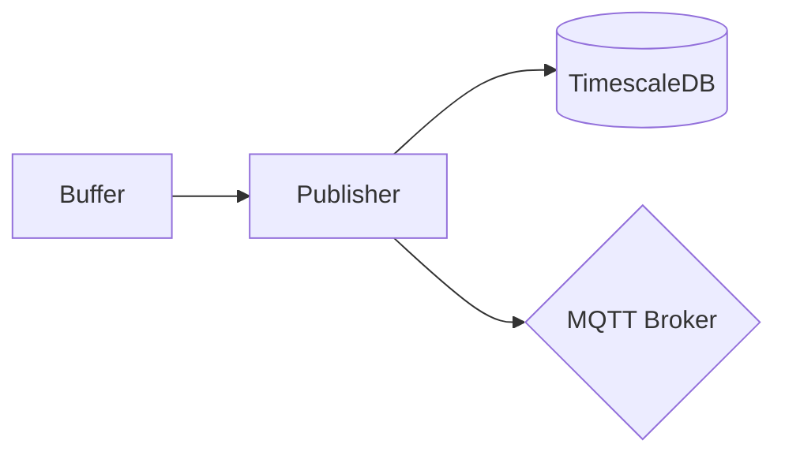
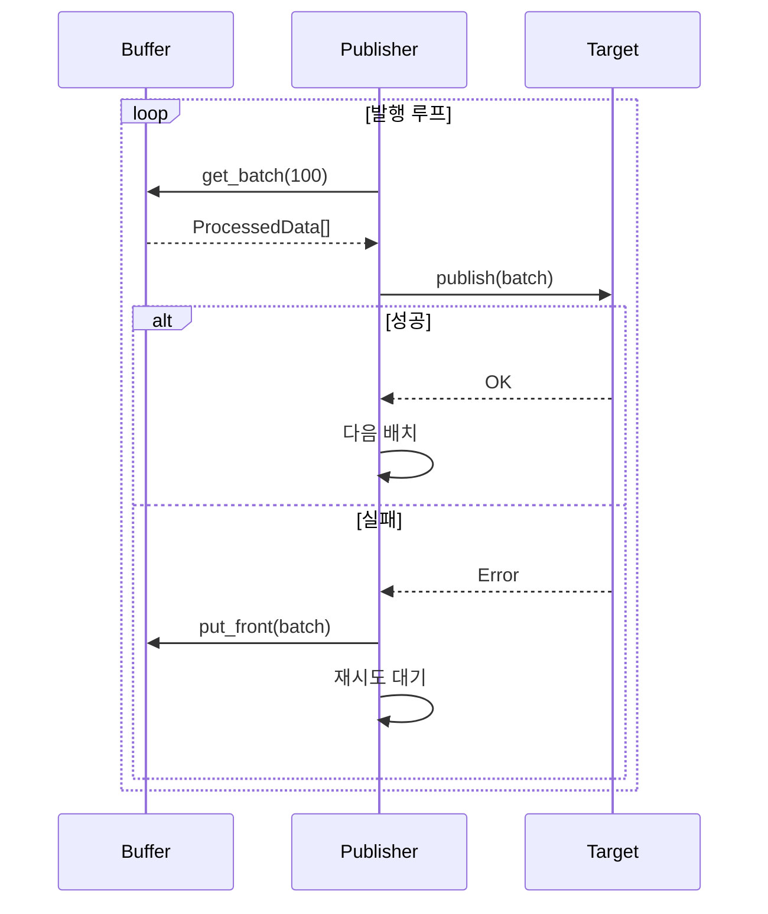

# Publisher 가이드

Simple Collector의 데이터 발행(Publisher) 기능을 안내합니다.

---

## 개요

**Publisher**는 수집된 데이터를 외부 시스템으로 전송하는 컴포넌트입니다.
버퍼에 저장된 데이터를 배치 단위로 발행합니다.



---

## 지원 Publisher

<div class="grid cards" markdown>

-   :material-database:{ .lg .middle } **Database Publisher**

    ---

    TimescaleDB/PostgreSQL로 데이터 저장

    - 시계열 데이터 최적화
    - 배치 INSERT
    - 마스터 테이블 동기화

    [:octicons-arrow-right-24: Database 가이드](database.md)

-   :material-wifi:{ .lg .middle } **MQTT Publisher**

    ---

    MQTT Broker로 실시간 발행

    - 실시간 모니터링
    - IoT 플랫폼 연동
    - JSON 메시지 형식

    [:octicons-arrow-right-24: MQTT 가이드](mqtt.md)

-   :material-file-document:{ .lg .middle } **JSON File Publisher**

    ---

    JSON 파일로 데이터 출력

    - MQTT와 동일한 JSON 포맷
    - Compact JSON (줄바꿈 없음)
    - 파일 로테이션 지원

    [:octicons-arrow-right-24: JSON File 가이드](json-file.md)

-   :material-rabbit:{ .lg .middle } **RabbitMQ Publisher**

    ---

    RabbitMQ 메시지 브로커로 발행

    - 분산 아키텍처 핵심 컴포넌트
    - Topic Exchange 기반 라우팅
    - zlib 압축 + Fernet 암호화

    [:octicons-arrow-right-24: RabbitMQ 가이드](rabbitmq.md)

</div>

---

## Publisher 비교

| 특성 | Database | MQTT | JSON File | RabbitMQ |
|------|----------|------|-----------|----------|
| **용도** | 장기 저장, 분석 | 실시간 모니터링 | 로컬 백업, 분석 | 분산 아키텍처 |
| **지연** | 배치 주기 | 즉시 | 즉시 (파일 I/O) | 배치 주기 |
| **신뢰성** | 높음 (ACID) | 중간 (QoS 의존) | 높음 (로컬 파일) | 높음 (Persistent) |
| **확장성** | 수직 확장 | 수평 확장 | 디스크 용량 | 수평 확장 |
| **상태** | 안정 | 베타 | 신규 | 신규 |

---

## 공통 동작

### 발행 흐름



### 재시도 로직

발행 실패 시 자동으로 재시도합니다:

1. 발행 실패 감지
2. 배치를 버퍼 앞쪽에 반환 (`put_front`)
3. 재시도 간격 대기
4. 다시 발행 시도

### 설정 예시

```yaml
publisher:
  database:
    enabled: true
    # ... 설정

  mqtt:
    enabled: true
    # ... 설정

buffer:
  max_size: 10000       # 버퍼 최대 크기
  batch_size: 100       # 배치 크기
```

---

## 데이터 형식

### ProcessedData 구조

```python
@dataclass
class ProcessedData:
    source_time: datetime      # PLC 시간
    server_time: datetime      # 서버 시간
    plc_id: int               # PLC ID
    tag_id: int               # 태그 ID
    value: Any                # 값
    quality_code: int         # 품질 코드 (1=정상, 0=실패)
    output_type: str          # 출력 타입 (float, int, text 등)
```

### 출력 타입 매핑

| 출력 타입 | DB 컬럼 | MQTT 필드 |
|----------|---------|-----------|
| `float` | v_float | value (number) |
| `int` | v_int | value (number) |
| `bigint` | v_bigint | value (number) |
| `text` | v_text | value (string) |
| `bool` | v_bool | value (boolean) |
| `byte` | v_byte | value (number) |

---

## 성능 고려사항

### 배치 크기

```yaml
buffer:
  batch_size: 100   # 권장: 100~500
```

| 배치 크기 | 장점 | 단점 |
|----------|------|------|
| 작음 (10~50) | 낮은 지연 | DB 부하 증가 |
| 중간 (100~200) | 균형 | - |
| 큼 (500~1000) | DB 효율 | 높은 지연 |

### 버퍼 크기

```yaml
buffer:
  max_size: 10000   # 권장: 초당 수집량 × 60초 × 2
```

**계산 예시:**

- 초당 100개 태그 수집
- 1분 장애 대비
- 안전 계수 2배
- `max_size = 100 × 60 × 2 = 12000`

---

## 오류 처리

### 연결 실패

```
ERROR | Database connection failed: Connection refused
```

**동작:**

1. 버퍼에 데이터 유지
2. 재연결 시도 (지수 백오프)
3. 연결 복구 시 자동 발행 재개

### 발행 실패

```
ERROR | Publish failed: Timeout
```

**동작:**

1. 배치를 버퍼에 반환
2. 재시도 대기
3. 최대 재시도 초과 시 로깅

### 버퍼 오버플로우

```
WARNING | Buffer overflow: dropping oldest 100 records
```

**동작:**

- `drop_oldest`: 오래된 데이터 삭제 (기본)
- `drop_newest`: 새 데이터 거부

---

## 모니터링

### 로그 확인

```bash
# 발행 로그
docker compose logs -f collector | grep publish

# 오류만 확인
docker compose logs collector | grep ERROR
```

### 메트릭

향후 지원 예정:

- 발행 성공/실패 횟수
- 평균 발행 지연
- 버퍼 사용량
- 재시도 횟수

---

<div align="center">

**NEUROSENSE Inc.** | *Intelligent Industrial Solutions*

</div>
