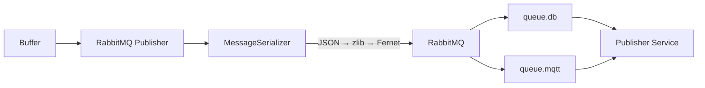

# RabbitMQ Publisher

RabbitMQ 메시지 브로커를 통한 데이터 발행 가이드입니다.

---

## 개요

**RabbitMQ Publisher**는 분산 아키텍처의 핵심 컴포넌트입니다.
ProcessedData 배치를 JSON → 압축 → 암호화(선택) 파이프라인을 거쳐
RabbitMQ Topic Exchange로 발행합니다.



---

## 설정

### 기본 설정

```yaml
publisher:
  rabbitmq:
    enabled: true
    host: "${RABBITMQ_HOST:rabbitmq}"
    port: 5672
    virtual_host: "/"
    username: "${RABBITMQ_USER:collector}"
    password: "${RABBITMQ_PASSWORD:secret}"
    exchange_name: "plc.data"
    exchange_type: "topic"              # topic | direct | fanout
    routing_key_prefix: "plc"           # routing_key: "plc.{plc_id}.data"
    compression: "zlib"                 # none | zlib | gzip
    encryption_enabled: false
    encryption_key: ""                  # Fernet key (base64)
    heartbeat: 60
    connection_timeout: 10
    delivery_mode: 2                    # 2=persistent
```

### 환경 변수

| 변수 | 설명 | 기본값 |
|------|------|--------|
| `RABBITMQ_HOST` | RabbitMQ 호스트 | localhost |
| `RABBITMQ_PORT` | AMQP 포트 | 5672 |
| `RABBITMQ_USER` | 사용자 이름 | guest |
| `RABBITMQ_PASSWORD` | 비밀번호 | guest |

---

## Exchange Topology

```
Topic Exchange "plc.data" (durable)
├── Binding: "plc.*.data" → queue.db      (Database batch insert)
└── Binding: "plc.*.data" → queue.mqtt    (MQTT forward)
```

- **Routing Key 패턴**: `plc.{plc_id}.data`
- **Exchange**: durable Topic Exchange
- **Delivery Mode**: Persistent (메시지 디스크 저장)

---

## 메시지 직렬화

`MessageSerializer`가 직렬화/역직렬화를 담당합니다.

### 직렬화 파이프라인

```
List[ProcessedData.to_dict()]
    ↓ json.dumps()
    ↓ zlib.compress() 또는 gzip.compress()
    ↓ Fernet.encrypt() (선택)
    → bytes (AMQP body)
```

### AMQP 메시지 헤더

```python
headers = {
    "compression": "zlib",          # 압축 알고리즘
    "encrypted": "false",           # 암호화 여부
    "plc_id": 1,                    # PLC 식별자
    "batch_count": 100,             # 배치 레코드 수
}
```

### 압축 효율

| 레코드 수 | 원본 크기 | zlib 압축 | 압축률 |
|-----------|----------|-----------|--------|
| 100 | ~40 KB | ~4 KB | ~90% |
| 500 | ~200 KB | ~15 KB | ~92% |
| 1000 | ~400 KB | ~25 KB | ~94% |

---

## 의존성

```
aio-pika>=9.4.0        # RabbitMQ async client (AMQP 0-9-1)
cryptography           # Fernet 암호화 (선택)
```

---

## Publisher Service 연동

RabbitMQ Publisher는 별도의 **collector-publisher** 서비스와 함께 사용됩니다.

### 구성 예시

```
[simple-collector (PLC 1)]  ──┐
[simple-collector (PLC 2)]  ──┼──▶ RabbitMQ ──▶ [collector-publisher]
[simple-collector (PLC N)]  ──┘                       │
                                                      ├──▶ TimescaleDB
                                                      └──▶ MQTT Broker
```

collector-publisher 프로젝트의 설정은 `collector-publisher/config/publisher.yaml`을 참조하세요.

---

## 모니터링

### 로그 확인

```bash
# RabbitMQ 연결 로그
docker compose logs collector | grep RabbitMQ

# 발행 통계 (VERBOSE 레벨)
docker compose logs collector | grep "Published.*records"
```

### RabbitMQ Management UI

```
http://localhost:15672
```

- 큐 depth 모니터링
- 메시지 rate 확인
- 연결 상태 확인

---

## 트러블슈팅

### 연결 실패

```
ERROR | RabbitMQ connection error: Connection refused
```

- RabbitMQ 컨테이너 상태 확인
- 포트 (5672) 접근 가능 여부 확인
- 사용자 인증 정보 확인

### 메시지 발행 실패

```
ERROR | RabbitMQ publish error: Channel closed
```

- RabbitMQ 서버 로그 확인
- Exchange 존재 여부 확인
- 네트워크 상태 확인

### 큐에 메시지 쌓임

```
queue.db: 10000 messages (ready)
```

- Publisher Service 상태 확인
- DB 연결 상태 확인
- consumer prefetch_count 조정

---

<div align="center">

**NEUROSENSE Inc.** | *Intelligent Industrial Solutions*

</div>
