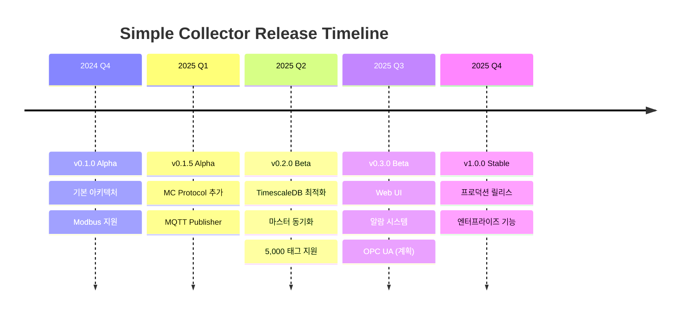

# 로드맵

Simple Collector의 개발 로드맵 및 향후 계획입니다.

---

## 버전 히스토리



---

## 현재 버전: v0.2.0-beta

### 완료된 기능

<div class="grid cards" markdown>

-   :material-check-circle:{ .success } Modbus TCP/RTU

    ---

    - Holding Register (HR)
    - Input Register (IR)
    - Coil / Discrete Input
    - 다중 데이터 타입

-   :material-check-circle:{ .success } MC Protocol

    ---

    - 미쓰비시 PLC 지원
    - D, M, W, X, Y 메모리
    - Binary/ASCII 통신

-   :material-check-circle:{ .success } TimescaleDB Publisher

    ---

    - COPY 프로토콜 고성능 INSERT
    - 마스터 테이블 동기화
    - 자동 Hypertable 활용

-   :material-check-circle:{ .success } MQTT Publisher

    ---

    - QoS 0/1/2 지원
    - JSON 페이로드
    - 자동 재연결

-   :material-check-circle:{ .success } 고성능 아키텍처

    ---

    - asyncio 비동기 처리
    - 연속 주소 병합 읽기
    - 메모리 효율적 버퍼링

-   :material-check-circle:{ .success } 운영 기능

    ---

    - 환경 변수 설정
    - Docker 컨테이너화
    - 구조화된 로깅

</div>

---

## v0.3.0-beta (2025 Q3)

### 예정 기능

#### 1. Web UI Dashboard

```
┌─────────────────────────────────────────────────────┐
│  Simple Collector Dashboard                     v0.3│
├─────────────────────────────────────────────────────┤
│                                                     │
│  ┌─────────┐  ┌─────────┐  ┌─────────┐  ┌────────┐ │
│  │ 5,000   │  │ 2,712   │  │ 100%    │  │ 58 MB  │ │
│  │ 태그    │  │ rec/sec │  │ 품질    │  │ 메모리 │ │
│  └─────────┘  └─────────┘  └─────────┘  └────────┘ │
│                                                     │
│  [실시간 차트]                                      │
│  ████████████████████░░░░░░░░░░░░░░░░░░░░░░░░░░░░ │
│                                                     │
│  [태그 목록]           [알람]          [설정]       │
│  - Tag_00001 ✓        ! 연결 끊김      ⚙ YAML     │
│  - Tag_00002 ✓        ! 품질 저하      ⚙ 태그     │
│  - Tag_00003 ✗                                      │
│                                                     │
└─────────────────────────────────────────────────────┘
```

| 기능 | 설명 | 우선순위 |
|------|------|---------|
| 실시간 모니터링 | 수집 상태, 처리량, 품질 | 높음 |
| 태그 브라우저 | 태그 목록, 현재 값, 이력 | 높음 |
| 설정 편집기 | YAML, CSV 온라인 편집 | 중간 |
| 로그 뷰어 | 실시간 로그 스트리밍 | 중간 |

#### 2. 알람 시스템

```yaml title="collector.yaml (예정)"
alarms:
  enabled: true

  rules:
    - name: "고온 경보"
      condition: "Temperature > 80"
      severity: critical
      actions:
        - type: mqtt
          topic: "alarms/critical"
        - type: webhook
          url: "https://api.example.com/alerts"

    - name: "연결 끊김"
      condition: "connection_lost"
      severity: warning
      cooldown_seconds: 300
```

#### 3. OPC UA 지원

| 기능 | 설명 |
|------|------|
| Client | OPC UA 서버에서 데이터 수집 |
| Browse | 노드 자동 검색 |
| Subscription | 변경 감지 구독 |
| Security | None, Sign, SignAndEncrypt |

---

## v1.0.0-stable (2025 Q4)

### 프로덕션 릴리스

#### 엔터프라이즈 기능

| 기능 | 설명 |
|------|------|
| 고가용성 | 이중화, 장애 복구 |
| 클러스터링 | 다중 노드 분산 수집 |
| 보안 강화 | TLS, 인증서 기반 인증 |
| 감사 로그 | 규정 준수 로깅 |
| API | REST API, GraphQL |

#### 성능 목표

| 지표 | 목표 |
|------|------|
| 단일 노드 태그 수 | 50,000 |
| 초당 처리량 | 20,000 rec/sec |
| 가용성 | 99.9% |
| 복구 시간 | < 30초 |

---

## v1.1.0 이후 (2026+)

### 장기 계획

#### 추가 프로토콜

| 프로토콜 | 설명 | 예상 시기 |
|----------|------|----------|
| EtherNet/IP | Allen-Bradley PLC | 2026 Q1 |
| PROFINET | Siemens PLC | 2026 Q2 |
| BACnet | 빌딩 자동화 | 2026 Q3 |
| IEC 61850 | 전력 시스템 | 2026 Q4 |

#### 추가 Publisher

| Publisher | 설명 | 예상 시기 |
|-----------|------|----------|
| InfluxDB | 시계열 DB | 2026 Q1 |
| Kafka | 스트리밍 플랫폼 | 2026 Q1 |
| AWS IoT | 클라우드 연동 | 2026 Q2 |
| Azure IoT Hub | 클라우드 연동 | 2026 Q2 |

#### AI/ML 통합

```
┌──────────────┐     ┌──────────────┐     ┌──────────────┐
│   Collector  │────▶│   AI Engine  │────▶│   Actions    │
│   (데이터)   │     │   (분석)     │     │   (자동화)   │
└──────────────┘     └──────────────┘     └──────────────┘
                            │
                            ▼
                     ┌──────────────┐
                     │  - 이상 감지  │
                     │  - 예측 정비  │
                     │  - 품질 예측  │
                     └──────────────┘
```

---

## 기능 요청

### 요청 방법

- 이메일: feature-request@neurosense.io

### 요청 템플릿

```markdown
## 기능 요청

### 요약
[기능에 대한 간단한 설명]

### 문제/필요성
[이 기능이 필요한 이유]

### 제안 솔루션
[구현 방법 제안]

### 대안
[고려한 다른 방법]

### 추가 정보
[스크린샷, 다이어그램 등]
```

---

## 버전 정책

### 시맨틱 버저닝

```
MAJOR.MINOR.PATCH[-PRERELEASE]

예: 1.2.3-beta

MAJOR: 호환성 깨지는 변경
MINOR: 새 기능 (호환 유지)
PATCH: 버그 수정
```

### 릴리스 주기

| 타입 | 주기 | 설명 |
|------|------|------|
| Major | 연 1회 | 대규모 변경 |
| Minor | 분기 1회 | 새 기능 |
| Patch | 필요 시 | 버그/보안 수정 |

### 지원 정책

| 버전 | 지원 기간 | 상태 |
|------|----------|------|
| v1.x (Stable) | 출시 후 2년 | LTS |
| v0.x (Beta) | 다음 버전까지 | 현재 |

---

<div align="center">

NEUROSENSE Inc. | Intelligent Industrial Solutions

로드맵은 변경될 수 있습니다.

</div>
